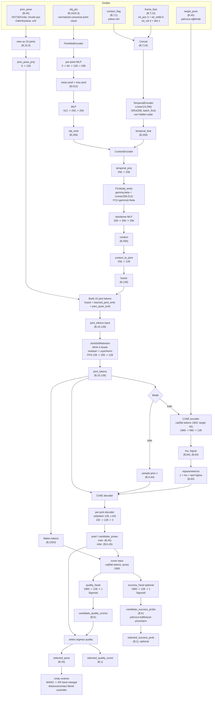

# B. Temporal Geometry-Conditioned Grasp Model

Bu tezde tek ana AI model vardır: **Temporal Geometry-Conditioned Grasp Model**. Model her inference çağrısında objenin 3B geometrisine ve son frame'lerdeki el hareketine göre parmak eklem rotasyonlarını (3×15), heuristik kalite skorunu (`quality_score`) ve varsa Unity'den öğrenilen başarı olasılığını (`success_prob`) üretir.

Ayrı bir Approach Model kullanılmaz. Kullanıcının bilek/controller hareketi korunur; model çıktısının XR ele ne kadar uygulanacağı Unity tarafındaki mesafe/temas tabanlı kural tabanlı blend controller ile belirlenir. Yani "objeye yakın bölgede devreye girme" davranışı modelin içinde ayrı bir AI fazı değil, runtime kontrol mantığıdır.

---

## B0. Model Mimarisi

Kaynak kod referansı: `src/model/grasp_model.py`, `src/model/model_io.py`.



**Birleşik girdi formatı:** Her iki veri seti aynı `frame_feat (B, T, 13)` formatını kullanır.
- OakInk statik: `T=1`, `rel_vel=0`, `dist` hesaplanır
- HOT3D temporal: `T>1`, sliding window

| Bileşen | Rol | Durum |
|---|---|---|
| Mini PointNet | Point cloud'dan obje feature (256-dim) | Uygulandı |
| FiLM conditioning | Obje feature'ını temporal feature'a enjekte eder | Uygulandı |
| GRU temporal encoder | Son T frame bilek hareketini işler | Uygulandı |
| Self-Attention (15 eklem) | Parmaklar arası koordinasyonu öğrenir | Uygulandı |
| CVAE decoder | Çok-modlu parmak pozu üretir | Uygulandı |
| Quality score head | Heuristik kalite skoru üretir (MSE) | Uygulandı; OakInk/HOT3D quality label üretiliyor |
| Success prob head | Unity binary başarı olasılığı üretir (BCE, Aşama 3) | Uygulandı; Unity success label varsa eğitilir |
| Approach controller | Mesafe/temas tabanlı faz geçişi | Kural tabanlı, AI değil |
| Unity evaluator | Fizik başarısını ölçer, success label üretir | Kalibrasyon/eval hattı |

### Mevcut Uygulama Durumu

Repo'daki güncel ana model `src/model/grasp_model.py` içinde `TemporalGeometryConditionedGraspModel` sınıfıdır (`GraspModel` alias'ı aynı sınıfa işaret eder):

| Bileşen | Mevcut Durum |
|---|---|
| Object encoder | Mini PointNet, `(x,y,z)` point cloud |
| Temporal encoder | `frame_feat(13) + contact_flag(1)` → Linear → GRU |
| Conditioning | FiLM ile obje embedding → temporal feature |
| Spatial eklem modeli | 15 MANO parmak eklemi üzerinde learned joint embedding + prev pose embedding + self-attention |
| Generative yapı | CVAE; eğitimde target pose ile latent posterior, inference'ta `K` adet prior sample |
| Input | `frame_feat(B,T,13) + obj_pts(B,1024,3) + prev_pose(B,45) + contact_flag(B,T,1)` |
| Output | `selected_pose(B,45)`, `candidate_poses(B,K,45)`, `candidate_quality_scores(B,K)`, opsiyonel `candidate_success_probs(B,K)` |
| Training | Phase 1 OakInk statik pretrain, Phase 2 HOT3D temporal fine-tune, opsiyonel Phase 3 success calibration |

Eski `wrist_feat(6)` arayüzü yalnızca backward-compatible wrapper olarak korunur; `wrist_feat_to_frame_feat()` bunu `frame_feat(B,1,13)` formatına dönüştürür. Yeni eğitim/eval/Unity yolu birleşik `frame_feat` sözleşmesini kullanır.

Desteklenen ablation varyantları:

| Varyant | Amaç |
|---|---|
| `encoder_type="gru" / "mlp"` | Temporal GRU ile single-frame MLP karşılaştırması |
| `obj_encoder_type="pointnet" / "bbox" / "none"` | Obje geometrisi temsilinin katkısı |
| `use_attention=True/False` | Parmak eklemleri arası self-attention katkısı |
| `use_film=True/False` | FiLM koşullaması ile concat koşullaması karşılaştırması |
| `use_success_head=True/False` | Unity success label yokken success head'i kapatma |

> **Kısıtlama — `obj_encoder_type="none"` + Phase 3:** `freeze_object_encoder` / `unfreeze_object_encoder`, `obj_encoder=None` durumunu tolere eder (fonksiyon erken döner). Phase 3 bu ablation varyantıyla güvenle çalışır.

---

## B1. Veri Rejimleri, Koordinat Sözleşmesi ve Eğitim

### Koordinat Sözleşmesi

Tüm bilek bilgisi **objeye göre relatif** (object frame) olarak ifade edilir. Her iki veri seti için aynı dönüşüm uygulanır:

```
T_wrist_in_object = T_object_in_world⁻¹ @ T_wrist_in_world

rel_pos   = T_wrist_in_object[:3, 3]               # (3,)  metre
rel_rot6d = rot_matrix_to_6d(T_wrist_in_object[:3,:3])  # (6,)  6D sürekli temsil
rel_vel   = (rel_pos[t] - rel_pos[t-1]) / Δt       # (3,)  m/s  — OakInk için sıfır
dist      = nearest_distance_to_surface(wrist/probes)  # (1,)  metre, signed SDF değil
```

OakInk'te `T_object_in_world` her annotation'da mevcuttur. HOT3D'de per-frame obje pozu annotation'da gelir. Bu dönüşüm `build_oakink_canonical.py` ve `build_hot3d_canonical.py`'ye eklenerek her iki dataset aynı semantik anlamı taşıyan feature üretir.

`dist` pratikte imzalı SDF değildir. OakInk/HOT3D tarafında mesh/point-cloud yüzeyine en yakın mesafe, Unity runtime tarafında collider/probe mesafesi kullanılır. Gerçek penetration fiziksel olarak Unity tarafında ölçülür; PyTorch training loss içindeki penetration terimi nearest-surface proxy'dir.

### Birleşik Girdi Formatı

Her iki veri seti `frame_feat (B, T, 13)` formatında modele verilir:

```
frame_feat = [rel_pos(3), rel_rot6d(6), rel_vel(3), dist(1)]  # 13 boyut
```

| Veri Seti | T | rel_vel | dist |
|---|---|---|---|
| OakInk | 1 | sıfır | bilek–yüzey mesafesi |
| HOT3D | >1 (sliding window) | hesaplanır | bilek–yüzey mesafesi |
| Unity runtime | >1 (ring buffer) | her frame hesaplanır | collider mesafesi |

Unity runtime HOT3D formatıyla özdeştir; bu yüzden tüm format HOT3D-style object-relative.

### Model Girdi/Çıktı Sözleşmesi

**Eğitim girdisi:**

| Alan | Boyut | Açıklama |
|---|---:|---|
| `frame_feat` | `(B, T, 13)` | Object-relative bilek hareketi |
| `contact_flag` | `(B, T, 1)` | Temas/transition sinyali — `frame_feat` ile concat → GRU'ya 14-dim |
| `prev_pose` | `(B, 45)` | Self-attention token'ları için önceki parmak pozu; OakInk'te yoksa sıfır |
| `prev2_pose` | `(B, 45)` | Phase 2 acceleration loss için opsiyonel |
| `finger_hist` | `(B, T, 45)` | HOT3D wrapper/eval tarafında geçmiş parmak pozu; model içine son frame `prev_pose` olarak girer |
| `obj_pts` | `(B, 1024, 3)` | Obje point cloud (canonical frame) |
| `obj_pts_contact` | `(B, 1024, 3)` | Contact/penetration loss için wrist frame metre ölçeğinde yüzey noktaları |
| `target_pose` | `(B, 45)` | Hedef parmak pozu |
| `quality_label` | `(B,)` | Heuristik kalite etiketi; MSE ile quality head'i eğitir |
| `success_label` | `(B,)` | Opsiyonel Unity physics etiketi; Phase 3 BCE için |

**Çıktı (inference, K aday):**

| Alan | Boyut | Açıklama |
|---|---:|---|
| `candidate_poses` | `(B, K, 45)` | K farklı latent sample → K kavrama adayı |
| `candidate_quality_scores` | `(B, K)` | Heuristic kalite skoru — her aday için ayrı hesaplanır (joint_tokens + pred_pose) |
| `candidate_success_probs` | `(B, K)` | Unity physics başarı olasılığı (Phase 3 etkinse) |
| `selected_pose` | `(B, 45)` | `argmax(quality_score)` ile seçilen aday |

> **Not — quality_head tasarımı:** `quality_head` girdi olarak `flat(joint_tokens) ‖ pred_pose` alır. Bu sayede k=1'den fazla aday üretildiğinde her aday farklı bir quality skoru alır ve seçim anlamlıdır. Önceki versiyonda `pred_pose` dahil edilmiyordu; tüm adaylar aynı skoru alıyordu (seçim rastgele eşdeğerdi).

> **Bilinen Kısıtlama — quality_head posterior/prior uyuşmazlığı:** Eğitimde `pred_pose` CVAE posterior z'sinden (target_pose encoder'dan geçirilir) üretilir; inference'ta ise adaylar prior z~N(0,I)'dan gelir. quality_head posterior dağılımda öğrenir ama prior dağılımındaki adayları skorlaması beklenir. `joint_tokens` (deterministik bağlam) hâlâ anlamlı bir ayrım sinyali sağlar; pred_pose katkısı sınırlıdır. İdeal çözüm: Phase 2'de auxiliary prior sample da quality_head'e geçirilmesi veya quality_head'in inference dağılımına ince ayar yapılması.

> **Not — GRU hidden state:** `TemporalEncoder` her forward çağrısında sıfır hidden state'ten başlar (PyTorch varsayılanı). Bu tasarım kararıdır: batch'ler arası bağımlılık yok, her sekans T-frame window ile kendi kendine yeterli. T=16 seçimi ablation A3'te (`ablation_gru_t1` vs `full`) karşılaştırılır.

> **Not — Phase 2 vel/acc pass contact_flag:** `prev_frame_feat` / `prev2_frame_feat` kaydırılmış pencerelerdir; bunlara karşılık gelen bir kaydırılmış `contact_flag` mevcut değildir. Önceki adım pasları `contact_flag=None` ile çağrılır; `TemporalEncoder` bu durumda sıfır doldurur. Mevcut pencere `contact_flag`'i geçmiş timestamp paslarına geçirmek semantik olarak yanlıştır.

> **Not — success_head:** Phase 3 Unity etiketleri yokken `use_success_head=False` ile model oluşturulabilir; bu durumda `success_head` parametresi hiç allocate edilmez. `use_success_head=True` ama `success_label` yoksa head forward çıktısı üretir fakat BCE ile kalibre edilmez. Bu durumda raporlamada `success_prob` fizik başarısı gibi yorumlanmamalıdır; aday seçimi kodda quality skoruna bağlıdır.

### Eklem Sırası

Modelin 45 boyutlu çıktısı MANO parmak axis-angle sırasını kullanır:

| Aralık | Parmak / Eklem |
|---|---|
| `0..8` | Index MCP, PIP, DIP |
| `9..17` | Middle MCP, PIP, DIP |
| `18..26` | Ring MCP, PIP, DIP |
| `27..35` | Pinky MCP, PIP, DIP |
| `36..44` | Thumb CMC, MCP, IP |

Unity tarafında bu sıra XR Hands kemik sırasına açık mapping tablosuyla retarget edilmelidir.

### Eğitim Planı (3 Aşama)

**Aşama 1 — OakInk Statik Pre-training**

OakInk öğretir: "Bu obje geometrisine göre geçerli final kavrama pozu nedir?"

```
Input:   frame_feat (B, 1, 13)   # T=1
Loss:    L_recon + β*L_KL + L_limit + λ_tip*L_tip
         + λ_c*L_contact + λ_p*L_penetration + λ_q*L_quality
         L_temporal_smooth YOK
β:       0 → kl_weight, warm-up; mevcut eğitim kodu varsayılanı 1e-3/argüman değeri
Optimizer: AdamW, lr ve batch training argümanlarından gelir
Durdurma: val L_recon 10 epoch iyileşmezse
```

**Aşama 2 — HOT3D Temporal Fine-tuning**

HOT3D öğretir: "El bu poza zaman içinde nasıl doğal ve stabil kapanır?"

```
Input:   frame_feat (B, T, 13)   # T=16 varsayılan; T=4,8 ablation
Batch:   %70 HOT3D + %30 OakInk  # OakInk'i unutmasın
Loss:    Aşama 1 loss
         + λ_vel * MSE((p̂_t - p̂_{t-1}), (p_t - p_{t-1}))
         + λ_acc * MSE((p̂_t - 2p̂_{t-1} + p̂_{t-2}), (p_t - 2p_{t-1} + p_{t-2}))
Optimizer: AdamW, lr=3e-4, batch=64
Grad clip: max_norm=1.0           # GRU için kritik
PointNet:  frozen değil, düşük LR ile fine-tune
```

**Aşama 3 — Confidence Kalibrasyonu**

```
quality_score head: heuristic label (contact ratio + penetration penalty + finger-distance penalty), MSE — hemen eğitilebilir
success_prob head:  Unity binary label, BCE — Unity eval tamamlanınca
Backbone:           training kodunda Phase 3'te object encoder dondurulur; success loss yalnızca success_label varsa aktiftir
```

## B2. PointNet Obje Encoder

Objenin geometrisi modelin en kritik girdisidir. Basit bir bounding box veya boyut vektörü, ince geometrik farkları (bardak kulpu, makas kolu, kalem ucu) yakalayamaz.

### Obje Temsili

Her obje mesh'i → **N=1024 nokta** örnekleme.

- Mevcut uygulama: her nokta `(x, y, z)` → 3 boyut
- E3 ablation varyantı: `(x, y, z) + yüzey normali (nx, ny, nz)` → 6 boyut
- Obje canonical frame'e dönüştürülür (obje rotasyonu çıkarılır; model orientasyon-invariant girdi alır, orientasyon ayrı input olarak verilir)

### Mimari

**Mini PointNet (güncel object encoder):**
```
1024 × 3
    │
MLP per point: 3 → 64 → 128 → 256
    │
mean pooling + max pooling
    │
Global Feature: 256-dim
```

### Çıktı

- `obj_global_feat`: 256-dim — objenin genel şekli

---

## B3. GRU Temporal Encoder

`frame_feat` ve `contact_flag` birleştirilerek GRU'ya verilir:

```
gru_input = concat(frame_feat(13), contact_flag(1))  # 14 boyut
        │
   GRU (hidden: 256)
        │
 Temporal Feature (B, 256)   ← son hidden state
```

- **Girdi:** `[rel_pos(3), rel_rot6d(6), rel_vel(3), dist(1), contact_flag(1)]` — 14 boyut
- **`contact_flag`:** Model temas/geçiş fazını girdi olarak bilir; sadece loss maskesi değil
- **Başlangıç penceresi:** T=8 (30 FPS'te ~270ms bağlam)
- **T=1 durumu (OakInk):** GRU tek adım çalışır; `contact_flag=0`, `rel_vel=0`
- **Causal:** Sadece geçmiş frame'lere bakar, gelecek bilgisi kullanılmaz

Temporal smoothness loss yalnızca T>1 batch'leri için hesaplanır.

---

## B4. Self-Attention — 15 Parmak Eklemi

GRU ve obje feature'ı fusion'dan sonra 15 parmak eklemi üzerinde self-attention uygulanır. Amaç: parmakların birbirinden bağımsız değil, koordineli hareket etmesini öğretmek (örn. güç kavramasında tüm parmaklar eş zamanlı kapanır; pinch'te sadece işaret ve başparmak).

Her token'a per-joint kimlik bilgisi eklenmeden aynı vektörü 15 kez kopyalamak self-attention'ı anlamsız kılar — tüm tokenlar özdeş başlar ve simetrik çıktı üretilir. Kimlik bilgisi iki kaynaktan gelir:

```python
# fusion_out: (B, 128) — GRU + object + previous pose fusion sonucu
# learned_joint_emb: (15, 128) — her ekleme öğrenilebilir kimlik, trainable param
# finger_hist: (B, T, 45) — önceki parmak pozları

# Önceki pozdan per-joint embedding:
prev_pose_emb = Linear(3, 128)(finger_hist[:, -1, :].view(B, 15, 3))  # (B, 15, 128)

joint_tokens = (fusion_out[:, None, :].expand(-1, 15, -1)  # paylaşılan bağlam
              + learned_joint_emb[None, :, :]               # eklem kimliği
              + prev_pose_emb)                              # önceki poz durumu

attn_out = SelfAttention(joint_tokens)                      # (B, 15, 128)
```

- **Kafa sayısı:** 4 head, eklem başına 128-dim
- **Katman sayısı:** 1 — 15 eklem küçük sequence, tek katman yeterli
- **`learned_joint_emb`:** Index MCP ile Thumb CMC farklı kimlik taşır; model hangi eklemin hangi parmağa ait olduğunu öğrenir
- **`prev_pose_emb`:** Önceki frame'de eklemin bulunduğu açı, token'a kinematik geçmiş katar
- **Neden tam Transformer değil:** Temporal bağımlılık GRU'da; self-attention yalnızca spatial (parmaklar arası) koordinasyon için. İki görevi ayrı tutmak debug'ı kolaylaştırır.

---

## B5. FiLM Conditioning (Obje Şekli)

Obje global feature'ı, ana ağa **FiLM (Feature-wise Linear Modulation)** ile enjekte edilir.

Basitçe FiLM, obje vektörünü ana ağın aktivasyonlarını "ayarlamak" için kullanır. Concatenation'da obje bilgisi sadece girişe eklenir; FiLM'de obje bilgisi katmanların içindeki feature'ları ölçekler ve kaydırır. Örneğin ince-uzun bir obje için parmak kapanış feature'ları farklı, geniş bir kupa için farklı modüle edilir.

### Mekanizma

```python
# obj_global_feat: (B, 256)
gamma, beta = Linear(256, hidden_dim * 2)(obj_global_feat).chunk(2, dim=-1)

# Ana gövde aktivasyonu (residual FiLM):
h_out = feat * (1.0 + gamma) + beta
```

`1 + gamma` residual formu kullanılır: gamma=0 başlangıcında h_out = h + beta, yani kondisyonsuz durum sıfırdan bozulmaz.

FiLM, obje bilgisini "ne öğrenileceğini şekillendir" şeklinde kullanır. Mevcut `src/model/grasp_model.py` implementasyonunda varsayılan conditioning mekanizması FiLM'dir; ablation için concat tabanlı alternatif de desteklenir.

---

## B6. CVAE Yapısı

Aynı objeyi farklı şekillerde kavramanın birden fazla geçerli yolu vardır (üstten güç kavraması, yandan kıstırma kavraması). CVAE bu çok-modluluğu modellemek için kullanılır.

```
Girdiler: joint_tokens + hedef parmak pozu (yalnızca eğitimde)
      │
Encoder (eğitimde):  flat(joint_tokens) ‖ target_pose → μ, logσ²
Decoder:             per-joint MLP(token ‖ z) → parmak pozu (15 × 3 eklem açısı)
      │
Çıktı: parmak konfigürasyonu
```

**Eğitim loss:**
```
L_cvae = L_recon + β * KL(q(z|x) || N(0,1))
```
β-VAE warm-up: β değeri 0'dan `kl_weight` argümanına lineer çıkar. Güncel training kodu bu üst değeri deney argümanından alır; eski "0→1" ifadesi bu implementasyon için fazla büyüktür.

---

## B7. Multi-Task Output Head

Model üç şey üretir: parmak açıları, heuristic kalite skoru ve fizik başarı olasılığı.

### Parmak Açısı Başlığı

```
Self-Attention çıktısı (B, 15, 128)
      │
Linear: 128 → 3   (per eklem)
      │
Çıktı: (B, 15, 3) → flatten → (B, 45)
```

XR Hands eklem başına 1–2 anlamlı serbestlik derecesi var; 3 çıktı vererek gereksiz eksenleri sıfıra doğru regularize etmek daha esnektir.

### Confidence: İki Ayrı Head

Heuristic "kalite" ile Unity "başarı" farklı kavramlardır ve ayrı head'lerle modellenir:

**quality_score** — sürekli, heuristic label, hemen eğitilebilir:
```
flat(joint_tokens, 15*128=1920) ‖ candidate_pose(45)
      │
Linear 1965 → 128 → 1  +  Sigmoid
      │
quality_score ∈ [0, 1]

Label: clip(w1*contact_ratio - w2*clip(pen/max_pen,0,1) - w3*clip(dist/max_dist,0,1), 0.0, 1.0)
       Başlangıç: w1=1.0, w2=0.3, w3=0.2
Loss:  MSE(quality_score, label)
```

**success_prob** — binary, Unity label, Aşama 3'te eğitilir:
```
flat(joint_tokens, 1920) ‖ candidate_pose(45)  # adaya özgü
      │
Linear 1965 → 128 → 1  +  Sigmoid
      │
success_prob ∈ [0, 1]

Label: Unity physics success/fail
Loss:  BCE(success_prob, unity_label)
```

Güncel inference kodunda K aday arasından seçim `argmax(quality_score)` ile yapılır. `success_prob` varsa aynı adaylar için ayrıca raporlanır; seçim kriteri değildir. Bunun nedeni Phase 3 Unity success label yokken veya yetersizken quality head'in daha güvenilir seçim sinyali olmasıdır.

### Loss Özeti (Eğitim Aşamalarına Göre)

| Aşama | Aktif Losslar |
|---|---|
| 1 — OakInk | `L_recon + β*L_KL + L_limit + L_tip + L_contact + L_penetration + L_quality` |
| 2 — HOT3D | Aşama 1 + `L_vel + L_acc` |
| 3 — Confidence | `L_success` success label varsa eklenir; training kodunda object encoder frozen |

---

## B8. Temporal Refinement ve Jitter Önleme

Sürekli inference'da parmak açıları frame'den frame'e zıplayabilir.

### Temporal Grasp Refinement İçin Gerekenler

Temporal çalışmak için model tek frame'den karar vermek yerine kısa bir geçmiş pencere kullanır. Bu pencere parmak kapanışının hızını, temas öncesi hazırlığı ve objeye göre yaklaşma dinamiğini taşır.

`frame_feat (B, T, 13)` ve `contact_flag (B, T, 1)` concat edilerek `gru_input (B, T, 14)` oluşturulur ve GRU'ya verilir (B3). Başlangıç penceresi T=8 (30 FPS'te ~270ms). Ablation: T=4, T=8, T=16.

**Temporal loss — ground-truth hız ve ivme farkı:**

Yalnızca `||p̂_t - p̂_{t-1}||` minimize etmek modelin "hareket etmemeyi" öğrenmesine yol açabilir. Doğru tanım tahmin edilen dinamiklerin GT dinamikleriyle eşleşmesini ister:

```
L_vel = MSE((p̂_t - p̂_{t-1}), (p_t - p_{t-1}))
L_acc = MSE((p̂_t - 2p̂_{t-1} + p̂_{t-2}), (p_t - 2p_{t-1} + p_{t-2}))
```

L2 norm yerine MSE kullanılır (ortalama kare fark); torch.nn.functional.mse_loss ile uyumlu.

Burada `p̂` model tahmini, `p` ground-truth (`finger_hist` veya `target_pose`). Ek smoothing istenirse düşük ağırlıklı `λ_smooth * ||p̂_t - p̂_{t-1}||` regularizer olarak eklenebilir.

Temporal katkı şu karşılaştırmayla savunulur:

> Single-frame model benzer pose hatası üretse bile temporal model daha düşük jitter, daha stabil temas ve daha yüksek Unity success sağlamalıdır.

### Yöntem 1 — Önceki Frame Girdisi

Bir önceki frame'in parmak pozu self-attention token'larına `prev_pose_emb` olarak eklenir (B4'te tanımlanmıştır). Eğitimde HOT3D için bu değer ground-truth `prev_pose` olarak gelir; runtime'da önceki model/retarget pozu kullanılabilir. Bu teacher-forcing farkı raporlanırken açık belirtilmelidir.

### Yöntem 2 — Exponential Moving Average (EMA) — Runtime

```python
output_smoothed = α * output_new + (1 - α) * output_prev
```
α = 0.7 — modelin kendi pürüzsüzlüğü yeterliyse α=1.0 (filtre yok).

İkisi birlikte kullanılabilir; model içi jitter önleme eğitimde, EMA ise runtime'da son güvenlik katmanı olarak.

---

## B9. Çoklu Kavrama Üretimi

Aynı nesne için birden fazla geçerli kavrama üretme özelliği korunmalıdır. Örneğin bir kupa kulptan, gövdeden veya üstten kavranabilir. Ancak bunu sağlamak için diffusion modelini ana sisteme almak şart değildir.

**Aday** nedir: Aynı bilek pozu + aynı obje için CVAE'den K farklı `z ~ N(0,1)` örneklenir. Her `z` farklı eklem konfigürasyonu üretebilir. PointNet global pooling kullandığı için lokal yüzey bölgeleri (kulp vs gövde) açıkça ayrıştırılamayabilir; adaylar "farklı kavrama stratejileri" değil "farklı eklem konfigürasyonları" olarak ifade edilmelidir.

Encoder bir kez çalışır; K aday paralel decoder batch'iyle üretilir:

```python
context = build_context(frame_feat, obj_pts, contact_flag)
joint_tokens = joint_tokens_from_context(context, prev_pose)       # (B, 15, 128)

z = torch.randn(B, K, latent_dim)                                  # (B, K, 64)
candidate_poses = cvae.sample(joint_tokens, k=K)                   # (B, K, 45)

flat = joint_tokens.reshape(B, 15*128)                             # (B, 1920)
score_input = concat(flat[:, None, :].expand(B,K,1920),
                     candidate_poses, dim=-1)                     # (B, K, 1965)
quality_scores = quality_head(score_input)                         # (B, K)
success_probs = success_head(score_input)                          # (B, K), opsiyonel

best_pose = candidate_poses[argmax(quality_scores)]                # (B, 45)
```

K=3 → tek encoder geçişi + paralel decoder batch < 10ms hedefi.

Tez ana sisteminde çoklu kavrama için CVAE kullanılır.

---

## B10. Offline Değerlendirme Metrikleri

### 1. Geodesic Rotation Error (Ana Metrik)

Axis-angle vektörleri üzerinde doğrudan MAE, SO(3) manifold yapısını görmezden gelir. Ana metrik geodesic error:

```
d(R_pred, R_gt) = arccos( (trace(R_pred^T R_gt) - 1) / 2 )   [radyan veya derece]
```

Her eklem için hesaplanır, ortalama raporlanır. Axis-angle MAE yalnızca debug/yardımcı metrik olarak tutulur.

### 2. MPJPE ve Fingertip Position Error

```
mpjpe         = mean over joints of ||FK(pred) - FK(gt)||      [mm]
fingertip_err = mean over 5 fingertips of ||pos_pred - pos_gt|| [mm]
```

Sezgisel olarak anlamlı: kaç mm kadar hatalı?

### 3. Joint-Limit Violation Rate

Anatomik sınırları aşan eklem yüzdesi. Modelin fiziksel olarak imkânsız pozlar üretip üretmediğini gösterir.

### 4. Contact Ratio

```
contact_ratio = (FK parmak uçları mesh'e < 5mm olan uç sayısı) / 5
```

**Hedef:** > 0.7

### 5. Penetration Depth

```
penetration = Unity PhysX/ComputePenetration veya eşdeğer fizik ölçümü [mm]
```

**Hedef:** < 3mm ortalama

Not: Eğitimdeki `L_penetration` gerçek SDF değildir; wrist frame'deki yüzey noktalarına nearest-distance tabanlı proxy kullanılır. Offline/Unity fizik raporunda penetration gerçek fizik/collider ölçümü olarak ayrılmalıdır.

### 6. Güven Skoru Kalibrasyonu

- Tahmin edilen güven skoru vs. Unity simülasyon başarısı için AUC-ROC
- Kalibrasyon eğrisi: perfect calibration'dan sapma (reliability diagram)

**Hedef:** AUC > 0.80

### 7. Diversity Score (CVAE için)

Aynı bilek pozu + obje için K=5 farklı örnek alınır:
```
diversity = mean pairwise distance between K samples
```
Daha yüksek diversity = daha fazla kavrama stratejisi çeşitliliği. Diversity vs. quality trade-off'u raporlanır.

---

## B11. Loss Fonksiyonu Özet

**Aşama 1 (OakInk):**
```
L = 1.0*(L_recon + β*L_KL) + λ_c*L_contact + λ_p*L_penetration + λ_q*L_quality
    + λ_limit*L_limit + λ_tip*L_tip
```

**Aşama 2 (HOT3D fine-tune, T>1 batch):**
```
L = Aşama_1_loss
    + λ_vel*MSE((p̂_t - p̂_{t-1}), (p_t - p_{t-1}))
    + λ_acc*MSE((p̂_t - 2p̂_{t-1} + p̂_{t-2}), (p_t - 2p_{t-1} + p_{t-2}))
```

**Aşama 3 (confidence kalibrasyon, backbone frozen):**
```
L = L_success eklenir; success_label yoksa bu terim aktif değildir.
```

| Loss terimi | Açıklama | Ne zaman aktif |
|---|---|---|
| `L_recon + β*L_KL` | CVAE pose reconstruction | Her zaman |
| `L_limit` | Soft anatomik joint limit ihlali | Her zaman |
| `L_tip` | FK parmak ucu pozisyon MSE | Her zaman |
| `L_contact` | Parmak uçları → nearest surface hinge loss | `obj_pts_contact` varsa |
| `L_penetration` | Nearest-surface proxy; gerçek SDF değil | `obj_pts_contact` varsa |
| `L_quality` | MSE(quality_score, heuristic_label) | `quality_label` varsa |
| `L_vel` | `MSE((p̂_t−p̂_{t−1}), (p_t−p_{t−1}))` — GT hız farkı | Yalnızca T>1 (HOT3D) |
| `L_acc` | `MSE((p̂_t−2p̂_{t−1}+p̂_{t−2}), (p_t−2p_{t−1}+p_{t−2}))` | Yalnızca T>1 (HOT3D) |
| `L_success` | BCE(success_prob, unity_label) | Yalnızca Aşama 3 |
