# AuraXR Tez Sunumu: Fikirden Phase 2'ye Detayli Anlatim

Bu dokuman, tez hocalarina projeyi adim adim anlatmak icin hazirlanmistir. Anlatim iki seviyeli tasarlandi:

- **Basit anlatim:** Konuyu ilk kez duyan birine anlatir gibi.
- **Teknik anlatim:** Tez hocasinin sorabilecegi ayrintilara cevap verecek sekilde.

Ana mesaj:

> Bu tez, VR/XR ortaminda kullanicinin controller ile hareket ettirdigi eli koruyarak, objenin 3B geometrisine ve elin zamansal hareketine gore parmak kavrama pozunu yapay zeka ile uretmeyi hedefler.

---

## 1. Projenin Ana Fikri

### Basit Anlatim

Bir kullanici VR ortaminda elini bir objeye yaklastiriyor. Kullanici elin genel hareketini kontrol ediyor: el nereye gidecek, bilek nasil donecek, obje hangi yonden tutulacak.

Ama parmaklarin nasil kapanacagi zor bir problem. Her obje ayni sekilde tutulmaz:

- Bardak farkli tutulur.
- Makas farkli tutulur.
- Tornavida farkli tutulur.
- Kulplu kupa farkli tutulur.

Bu projede yapay zeka, kullanicinin elini objeye yaklastirdigini gorunce parmaklari objeye uygun sekilde kapatiyor.

### Teknik Anlatim

Sistemin hedefi, gerçek zamanli XR ortaminda **object-conditioned hand grasp synthesis** yapmaktir.

Modelin urettigi ana cikti:

```text
finger_aa45 = 15 parmak eklemi x 3 axis-angle rotasyon = 45 boyut
```

Kullanici bilek hareketini kontrol etmeye devam eder. Model sadece parmak eklem rotasyonlarini tahmin eder. Bu sayede kullanici kontrolu kaybetmez, ama grasp daha dogal ve objeye uygun hale gelir.

### Hocaya Soylenecek Net Cumle

> Bu tezde kullanicinin controller tabanli bilek hareketini koruyup, objenin 3B geometrisine ve elin son frame'lerdeki hareketine gore parmak kavrama pozunu ureten temporal geometry-conditioned bir grasp modeli gelistirdim.

---

## 2. Problem Neden Zor?

### Basit Anlatim

Bir elin objeyi tutmasi sadece "parmaklari kapat" demek degildir. Parmaklar:

- objeye yaklasmali,
- objeye temas etmeli,
- objenin icine girmemeli,
- anatomik olarak mumkun acilarda kalmali,
- bir frame'den digerine titrememeli,
- objenin sekline gore farkli pozisyon almali.

### Teknik Anlatim

Grasp uretimi su alt problemlerin birlesimidir:

| Alt Problem | Aciklama |
|---|---|
| Geometri uyumu | Parmaklar objenin sekline gore konumlanmali |
| Temporal stabilite | Frame-to-frame jitter dusuk olmali |
| Contact | Parmak uclari yuzeye yakin olmali |
| Penetration | Parmaklar objenin icine girmemeli |
| Joint limits | Anatomik limitler asilmamali |
| Multi-modality | Ayni obje icin birden fazla gecerli grasp olabilir |
| Runtime uygunlugu | XR ortaminda dusuk latency ile calismali |

### Klasik Yaklasimlarin Siniri

| Yaklasim | Problem |
|---|---|
| Hazir animasyon | Her objeye uymaz |
| Kural tabanli parmak kapatma | Dogal durmaz, penetrasyon ve jitter uretir |
| Tek-frame model | Zamansal kapanis davranisini goremez |
| Sadece bbox kullanan model | Ince obje geometrisini ayirt edemez |

---

## 3. Sistem Seviyesinde Karar

Ilk fikirde iki ayri AI model dusunulmustu:

- Approach Model: El objeye nasil yaklasmali?
- Grasp Model: Parmaklar nasil kapanmali?

Guncel implementasyonda tez kapsaminda ana ogrenilen model **Grasp Model** oldu. Approach kismi Unity tarafinda kural tabanli blend/controller mantigiyla yonetiliyor.

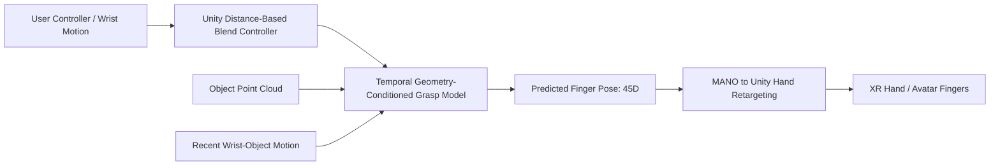

### Neden Bu Karar Mantikli?

Bu karar problemi daha olculebilir hale getirir:

- Kullanici kontrolu korunur.
- Modelin gorevi netlesir: parmak pozu uretmek.
- Approach basarisizligi ile grasp basarisizligi birbirine karismaz.
- Phase 1 ve Phase 2 egitimleri daha temiz analiz edilir.

### Hocaya Soylenecek Net Cumle

> Baslangicta approach ve grasp icin iki model planlanmisti. Ancak tez kapsaminda ogrenilen ana bileseni grasp modeline odakladim. Approach/gecis davranisini Unity tarafinda deterministic blend controller ile cozdum. Boylece modelin performansini dogrudan parmak pozu, contact, jitter ve fiziksel basari metrikleriyle inceleyebiliyorum.

---

## 4. Veri Setleri ve Rolleri

Projede iki ana veri seti var: OakInk ve HOT3D.

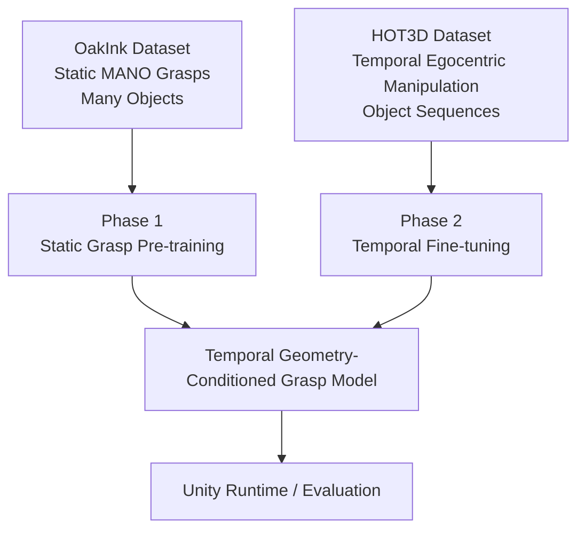

## 4.1. OakInk

### Basit Anlatim

OakInk modele "bir obje nasil tutulur?" sorusunu ogretir. Cok fazla obje ve cok fazla final grasp pozu vardir.

Ama OakInk video gibi degildir. Sadece son kavrama pozunu gosterir.

### Teknik Anlatim

OakInk:

- MANO tabanli statik grasp veri setidir.
- 1800 civari obje ve 50K+ grasp pozu icerir.
- Obje cesitliligi yuksektir.
- Temporal sekans saglamaz.

Modele ogrettigi sey:

> Obje geometrisi ile final parmak pozu arasindaki iliski.

Phase 1'de kullanilir.

```text
OakInk input:
T = 1
rel_vel = 0
frame_feat = (B, 1, 13)
```

## 4.2. HOT3D

### Basit Anlatim

HOT3D modele "el objeye yaklasirken parmaklar zaman icinde nasil kapanir?" sorusunu ogretir.

OakInk bir fotograf gibiyse, HOT3D kisa bir video gibidir.

### Teknik Anlatim

HOT3D:

- Egocentric Aria / Quest 3 kayitlarindan olusur.
- El ve obje hareketini frame frame verir.
- Yaklasma, tutma, inceleme, birakma gibi manipülasyon sekanslari icerir.
- Obje sayisi OakInk'ten daha azdir.

Modele ogrettigi sey:

> Temporal kapanis davranisi ve frame-to-frame stabilite.

Phase 2'de kullanilir.

```text
HOT3D input:
T = 16
frame_feat = (B, 16, 13)
```

## 4.3. Neden Iki Veri Seti Birlikte?

| Veri Seti | Guclu Taraf | Zayif Taraf | Projedeki Rol |
|---|---|---|---|
| OakInk | Obje cesitliligi yuksek | Temporal hareket yok | Statik grasp pre-training |
| HOT3D | Zamansal hareket var | Obje cesitliligi dusuk | Temporal fine-tuning |

### Hocaya Soylenecek Net Cumle

> OakInk modeli genis obje cesitliligi ile statik grasp bilgisine hazirliyor. HOT3D ise bu bilgiyi zamansal el-obje hareketine adapte ediyor. Bu nedenle iki veri setini ayni model arayuzunde birlestirdim.

---

## 5. Veri Hazirlama: Her Seyin Ayni Dile Cevrilmesi

OakInk ve HOT3D farkli formatlarda gelir. Modelin bunlari ayni sekilde anlayabilmesi icin ortak bir canonical temsil olusturdum.

Ana temsil:

```text
frame_feat = [rel_pos(3), rel_rot6d(6), rel_vel(3), dist(1)]
Toplam = 13 boyut
```

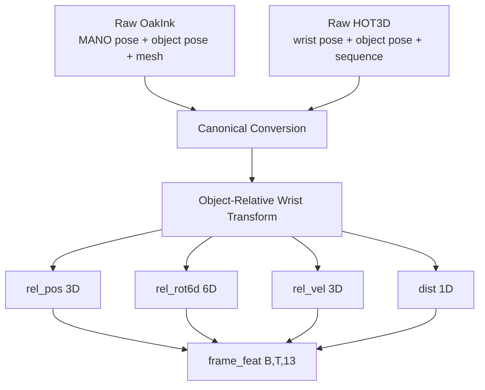

## 5.1. Object-Relative Koordinat

Modelin dunya koordinatini ezberlememesi icin el bilegini objeye gore ifade ediyoruz.

Formul:

```text
T_wrist_in_object = inverse(T_object_in_world) @ T_wrist_in_world
```

Buradan:

```text
rel_pos   = T_wrist_in_object translation
rel_rot6d = T_wrist_in_object rotation as 6D
rel_vel   = rel_pos[t] - rel_pos[t-1]
dist      = wrist-object surface distance
```

### Basit Anlatim

Model icin onemli olan elin odanin neresinde oldugu degil, objeye gore nerede oldugudur.

Bardak masanin saginda da olsa solunda da olsa, el bardağa ayni sekilde yaklasiyorsa model ayni durumu gormelidir.

## 5.2. Neden 6D Rotation?

Rotasyon icin Euler acilari kullanmak sorunlu olabilir:

- Gimbal lock olabilir.
- Sureksizlik yaratabilir.
- Neural network icin ogrenmesi zor olabilir.

Bu yuzden rotasyon 6D representation ile verilir. Bu, rotation matrix'in ilk iki kolonunu kullanarak daha surekli bir temsil saglar.

## 5.3. OakInk ve HOT3D Ayni Arayuzde

| Alan | OakInk | HOT3D |
|---|---|---|
| `frame_feat` | `(B,1,13)` | `(B,16,13)` |
| `rel_pos` | Var | Var |
| `rel_rot6d` | Var | Var |
| `rel_vel` | Sifir | Frame farkindan hesaplanir |
| `dist` | Mesh/point cloud mesafesi | Nearest-surface mesafesi |
| `target_pose` | Statik MANO parmak pozu | Zaman t'deki parmak pozu |

### Hocaya Soylenecek Net Cumle

> En kritik altyapi katkilarindan biri OakInk ve HOT3D'yi tek bir `frame_feat(B,T,13)` sozlesmesine cevirmek oldu. Bu sayede statik ve temporal veri ayni model mimarisiyle egitilebildi.

---

## 6. Obje Temsili: Point Cloud ve Mini PointNet

Objeyi modele sadece boyut vektoru olarak vermek yeterli degil. Cunku ayni bounding box'a sahip iki obje cok farkli tutulabilir.

Ornek:

- Bardak ve silindir benzer olabilir, ama bardakta kulp vardir.
- Makas ince ve bosluklu bir geometriye sahiptir.
- Tornavida uzun ve ince tutulur.

Bu yuzden her obje 1024 noktalik point cloud olarak verilir.

```text
obj_pts = (B, 1024, 3)
```

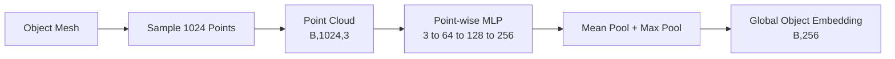

### Teknik Detay

Mini PointNet encoder:

```text
Per-point MLP: 3 -> 64 -> 128 -> 256
Pooling: mean + max
Projection: 512 -> 256 -> 256
Output: obj_emb (B,256)
```

### Hocaya Soylenecek Net Cumle

> Obje geometrisini basit bbox yerine 1024 noktalik point cloud ile temsil ettim. Mini PointNet bu noktalar uzerinden 256 boyutlu global obje embedding'i uretiyor. Bu embedding, grasp modelini objenin sekline kosullamak icin kullaniliyor.

---

## 7. Modelin Genel Mimarisi

Modelin adi:

```text
Temporal Geometry-Conditioned Grasp Model
```

Ana girdiler:

| Girdi | Boyut | Anlam |
|---|---:|---|
| `frame_feat` | `(B,T,13)` | El bileginin objeye gore son T frame hareketi |
| `contact_flag` | `(B,T,1)` | Temas/yakinlik sinyali |
| `obj_pts` | `(B,1024,3)` | Obje point cloud |
| `prev_pose` | `(B,45)` | Onceki parmak pozu |
| `target_pose` | `(B,45)` | Egitimde hedef poz |

Ana ciktilar:

| Cikti | Boyut | Anlam |
|---|---:|---|
| `selected_pose` | `(B,45)` | Secilen parmak pozu |
| `candidate_poses` | `(B,K,45)` | K adet grasp adayi |
| `quality_score` | `(B,K)` | Heuristik kalite skoru |
| `success_prob` | `(B,K)` | Unity label ile kalibre edilirse fiziksel basari olasiligi |

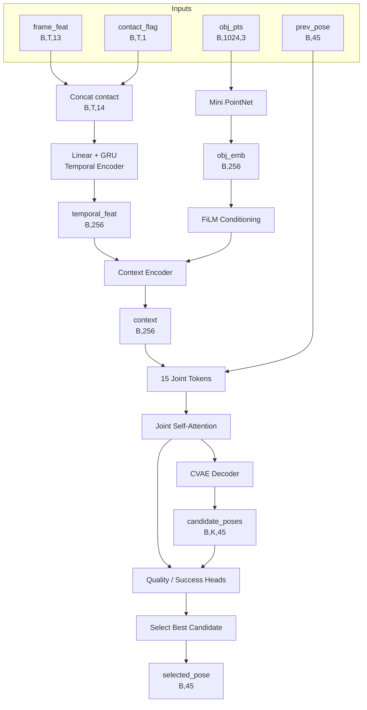

---

## 8. Model Bilesenleri

## 8.1. Temporal Encoder: GRU

### Basit Anlatim

Model sadece tek bir fotografa bakmiyor. Elin son 16 frame boyunca nasil hareket ettigine bakiyor.

Bu sayede:

- el objeye yaklasiyor mu,
- uzaklasiyor mu,
- hizli mi,
- temas baslamis mi,
- bilek yonu nasil degisiyor,

bunlari gorebiliyor.

### Teknik Anlatim

```text
Input: frame_feat(B,T,13) + contact_flag(B,T,1)
Concatenated input: (B,T,14)
Linear: 14 -> 256
GRU: hidden_dim = 256
Output: last hidden state = temporal_feat(B,256)
```

OakInk icin:

```text
T = 1
rel_vel = 0
```

HOT3D icin:

```text
T = 16
```

## 8.2. FiLM Conditioning

FiLM, obje bilgisini temporal feature'a enjekte eder.

Formul:

```text
gamma, beta = Linear(obj_emb)
h_out = h * (1 + gamma) + beta
```

Basit anlatim:

> Modelin el hareketi yorumu, objenin sekline gore ayarlaniyor.

Ornek:

- Ayni bilek hareketi bardak icin farkli,
- tornavida icin farkli,
- makas icin farkli parmak kapanisi gerektirebilir.

## 8.3. Joint Self-Attention

Parmak eklemleri birbirinden bagimsiz degil. Basparmak, isaret parmagi ve diger parmaklar koordineli calismali.

Model 15 parmak eklemini token gibi ele alir.

```text
15 joint token
Her token = context + joint identity + previous pose embedding
```

Sonra Multi-Head Self-Attention uygulanir.

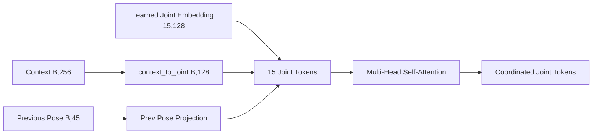

### Hocaya Soylenecek Net Cumle

> Self-attention ile 15 parmak eklemini birlikte modelliyorum. Boylece model, her eklemi izole tahmin etmek yerine parmaklar arasi koordinasyonu ogreniyor.

## 8.4. CVAE Decoder

Ayni obje icin tek dogru grasp yoktur.

Bir bardak:

- kulptan,
- govdeden,
- ustten,
- yandan

tutulabilir.

Bu nedenle model CVAE ile K adet aday uretebilir.

```text
candidate_poses = (B,K,45)
```

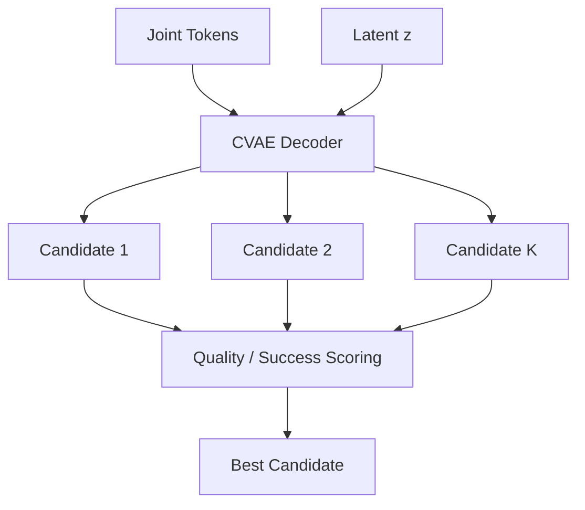

### Mevcut Bulgu

Mimari K aday uretmeyi destekliyor. Fakat mevcut eval sonucunda:

- K=1, K=3, K=5 arasinda anlamli iyilesme gorulmedi.
- Diversity score dusuk kaldi.

Yorum:

> CVAE altyapisi var, ancak latent uzay yeterince cesitli grasp uretmiyor. KL sweep veya prior-sample quality egitimi sonraki iyilestirme alani.

---

## 9. Loss Fonksiyonlari

Model sadece acilari kopyalamaya calismaz. Ayni anda birden fazla hedefi optimize eder.

## 9.1. Phase 1 Loss

Phase 1 OakInk statik pre-training icin:

```text
L = L_recon
  + beta * L_KL
  + L_limit
  + lambda_tip * L_tip
  + lambda_contact * L_contact
  + lambda_penetration * L_penetration
  + lambda_quality * L_quality
```

| Loss | Amac |
|---|---|
| `L_recon` | Tahmin edilen 45D parmak pozu ground truth'a benzesin |
| `L_KL` | CVAE latent uzayi duzenli olsun |
| `L_limit` | Anatomik olmayan eklem acilari cezalandirilsin |
| `L_tip` | Parmak ucu pozisyonlari ground truth'a yaklassin |
| `L_contact` | Parmak uclari obje yuzeyine yaklassin |
| `L_penetration` | Parmaklar objenin icine girmesin |
| `L_quality` | Heuristik quality score ogrenilsin |

## 9.2. Phase 2 Loss

Phase 2 HOT3D temporal fine-tuning'de Phase 1 loss'una zamansal terimler eklenir:

```text
L_phase2 = L_phase1
         + lambda_vel * L_vel
         + lambda_acc * L_acc
```

| Loss | Amac |
|---|---|
| `L_vel` | Tahmin edilen parmak hareket hizi ground truth hizina benzesin |
| `L_acc` | Ivme farki azalsin, ani jitter dusurulsun |

Basit anlatim:

> Phase 1 modelin eli dogru sekle sokmasini ogretiyor. Phase 2 bu hareketin zaman icinde daha dogal olmasini ogretiyor.

---

## 10. Phase 1: OakInk Statik Pre-training

## 10.1. Phase 1'in Amaci

Phase 1'in amaci:

> Modele cok sayida obje uzerinden final grasp pozu bilgisini ogretmek.

OakInk kullanilir:

```text
Input: frame_feat(B,1,13)
T = 1
rel_vel = 0
Output: finger pose 45D
```

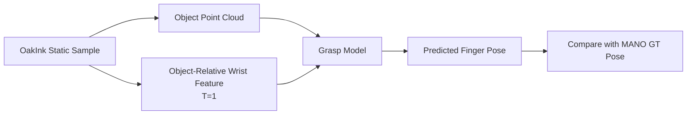

## 10.2. Phase 1 Egitim Mantigi

Model once objelerin nasil tutuldugunu ogrenir. Bu asamada temporal hareket yoktur.

Bu asama su soruya cevap verir:

> Bu obje geometrisine ve elin bu konumuna gore final parmak pozu nasil olmali?

## 10.3. Phase 1 Sonuclari

Egitim loglarina gore:

| Epoch | Train Reconstruction | Validation Reconstruction |
|---:|---:|---:|
| 0 | Yaklasik 0.040 | Yaklasik 0.028 |
| 10 civari | Yaklasik 0.020 | Yaklasik 0.018-0.020 |
| Son epoch'lar | Yaklasik 0.012-0.013 | Yaklasik 0.012-0.013 |

Genel gozlem:

- Reconstruction loss ciddi sekilde dustu.
- Model statik parmak pozunu ogrenebildi.
- OakInk uzerinde geodesic error yaklasik 9-10 derece seviyesine geldi.
- MPJPE yaklasik 5-6 mm seviyesinde.
- Quality score OakInk'te anlamli korelasyon verdi: Spearman yaklasik 0.72.

## 10.4. Phase 1'in Sinirlari

Phase 1 sadece statik pozu ogretir. Bu nedenle:

- Elin zamansal kapanisini ogretmez.
- Jitter davranisini tam kontrol edemez.
- Contact ratio dusuk kalabilir.
- Unity fiziksel basari henuz garanti degildir.

### Hocaya Soylenecek Net Cumle

> Phase 1, modelin obje geometrisi ile final grasp pozu arasindaki iliskiyi ogrenmesini sagladi. Reconstruction ve geodesic error tarafinda makul sonuc verdi, ancak contact ve fiziksel stabilite icin tek basina yeterli degil.

---

## 11. Phase 2: HOT3D Temporal Fine-tuning

## 11.1. Phase 2'nin Amaci

Phase 2'nin amaci:

> Phase 1'de statik grasp ogrenmis modeli, HOT3D sekanslariyla zamansal el kapanis davranisina adapte etmek.

Bu asamada model artik son 16 frame'e bakar:

```text
frame_feat(B,16,13)
```

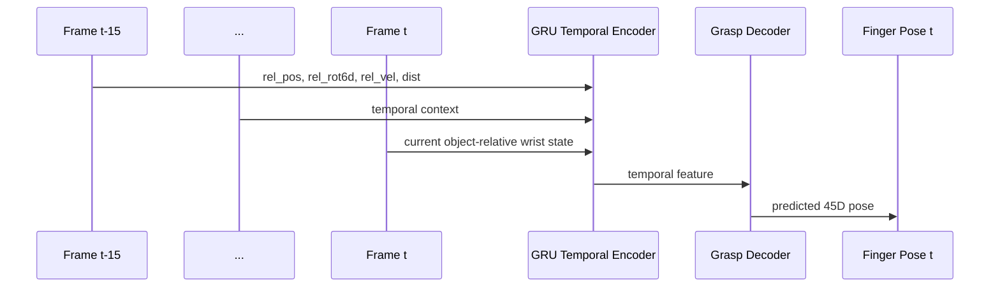

## 11.2. Neden OakInk Replay Var?

Phase 2'de batch karisimi:

```text
%70 HOT3D + %30 OakInk replay
```

Sebep:

> Model HOT3D temporal hareketi ogrenirken OakInk'ten ogrendigi genis obje-grasp bilgisini unutmasin.

Teknik terim:

```text
catastrophic forgetting'i azaltmak
```

## 11.3. Phase 2'de Eklenen Temporal Loss

Phase 2 sadece t anindaki pozu tahmin etmez. Ayni zamanda onceki frame tahminleriyle hareket farklarini da karsilastirir.

```text
Velocity:
pred_t - pred_t-1 ~= gt_t - gt_t-1

Acceleration:
pred_t - 2*pred_t-1 + pred_t-2 ~= gt_t - 2*gt_t-1 + gt_t-2
```

Bu, modelin frame-to-frame hareketini daha stabil hale getirmek icindir.

## 11.4. Phase 2 Sonuclari

Gozlemler:

- HOT3D temporal test geodesic error yaklasik 12-13 derece seviyesinde.
- MPJPE yaklasik 6-7 mm seviyesinde.
- Temporal pipeline calisiyor.
- Velocity loss aktif ve kucuk degerlerde.
- Acceleration loss daha zor ogreniliyor.
- Phase 2'de val reconstruction, Phase 1'e gore yuksek. Bu beklenen bir durum, cunku HOT3D dagilimi daha zor ve temporal.

## 11.5. Phase 2'nin Sinirlari

Phase 2 sonrasi halen acik problemler:

| Problem | Gozlem |
|---|---|
| Contact ratio dusuk | Parmak uclari her zaman yuzeye yeterince yaklasmiyor |
| Joint limit violation yuksek | Temporal fine-tuning sonrasi anatomik ihlal artabiliyor |
| Quality score HOT3D'de zayif | OakInk'te anlamli, HOT3D temporal'de zayif korelasyon |
| CVAE diversity dusuk | K aday uretimi anlamli fark yaratmiyor |
| Unity success calibration yok | `success_prob` henuz fiziksel basari gibi yorumlanamaz |

### Hocaya Soylenecek Net Cumle

> Phase 2, modelin statik grasp bilgisini temporal sekanslara tasidi. Model artik son 16 frame'i kullanarak parmak pozu uretiyor. Ancak fiziksel temas kalitesi, joint limit ihlalleri ve Unity tabanli success calibration henuz gelistirilmesi gereken ana konular.

---

## 12. Phase 1 ve Phase 2 Arasindaki Fark

| Ozellik | Phase 1 | Phase 2 |
|---|---|---|
| Veri | OakInk | HOT3D + OakInk replay |
| Veri tipi | Statik grasp | Temporal sekans |
| T | 1 | 16 |
| rel_vel | 0 | Hesaplaniyor |
| Ana hedef | Final grasp pozu ogrenmek | Zamansal kapanis davranisi ogrenmek |
| Ek loss | Yok | Velocity + acceleration |
| Ogrenilen bilgi | Obje-geometri-grasp iliskisi | Frame-to-frame parmak hareketi |

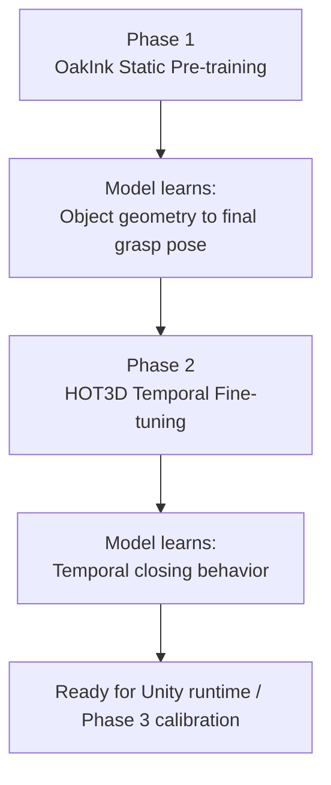

---

## 13. Unity Entegrasyonu

Unity bu tezde iki rol oynar:

1. Model ciktisini XR/Avatar ele uygulamak.
2. Gelecekte fiziksel success label uretmek.

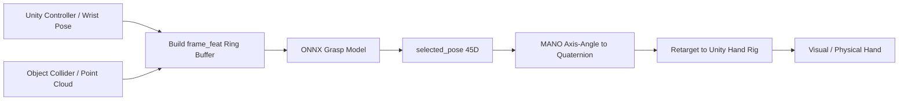

## 13.1. Runtime Akisi

Unity tarafinda:

1. Controller veya XR Hands bilek pozu okunur.
2. Obje pozu ve mesafe hesaplanir.
3. Son T frame icin `frame_feat` ring buffer'da tutulur.
4. Obje point cloud modele verilir.
5. ONNX model `selected_pose(45D)` uretir.
6. Axis-angle rotasyonlar quaternion'a cevrilir.
7. MANO eklem sirasi Unity rig'e retarget edilir.
8. Blend controller, kullanici parmak pozuyla model pozunu yumusak gecirir.

## 13.2. Unity ONNX Kisitlari

Unity InferenceEngine/Sentis tarafi bazi ONNX operatorlerini desteklemeyebilir. Bu yuzden Unity export icin deterministik bir model yolu hazirlandi:

- GRU manuel unroll edildi.
- CVAE randomness kaldirildi.
- K=1 deterministik cikti kullanildi.
- Sabit shape'li graph export edildi.

Bu, Unity demo icin pratik ve stabil bir yoldur.

### Hocaya Soylenecek Net Cumle

> Arastirma tarafinda model K adayli CVAE olarak calisabiliyor, fakat Unity runtime icin deterministic K=1 ONNX export kullandim. Bunun nedeni Unity inference backend'inin GRU operatoru ve random sampling gibi dinamik yapilarda kisitli olmasi.

---

## 14. Evaluation Metrikleri

Modeli sadece loss ile degerlendirmek yeterli degil. Bu nedenle farkli metrikler kullaniliyor.

| Metrik | Ne Olcer? |
|---|---|
| Geodesic rotation error | Eklem rotasyon hatasi |
| MPJPE | Eklem pozisyon hatasi |
| Fingertip error | Parmak ucu pozisyon hatasi |
| Contact ratio | Parmak uclarinin objeye temas/yakinlik orani |
| Penetration depth | Parmaklarin objenin icine girme miktari |
| Joint limit violation | Anatomik limit asimi |
| Jitter velocity | Frame-to-frame hareket titremesi |
| Jitter acceleration | Ani hareket degisimi |
| Diversity score | CVAE adaylarinin birbirinden farkliligi |
| Quality AUC / Spearman | Quality head'in label ile iliskisi |

## 14.1. Geodesic Error

Axis-angle MAE tek basina guvenilir degildir. Rotasyonlar icin geodesic error kullanilir.

```text
d(R_pred, R_gt) = arccos((trace(R_pred^T R_gt) - 1) / 2)
```

## 14.2. Contact Ratio

```text
contact_ratio = objeye 5mm'den yakin parmak ucu sayisi / 5
```

Bu metrik su soruya cevap verir:

> Parmaklar gercekten objeye yaklasiyor mu?

## 14.3. Jitter

Temporal model icin sadece t anindaki hata yetmez. Ardarda frame'lerde hareketin ne kadar stabil oldugu da onemli.

```text
jitter_vel = mean d(R_t, R_t-1)
jitter_acc = mean |d(R_t,R_t-1) - d(R_t-1,R_t-2)|
```

---

## 15. Mevcut Sonuclarin Yorumlanmasi

## 15.1. Basarili Taraflar

| Basari | Aciklama |
|---|---|
| Ortak veri arayuzu calisiyor | OakInk ve HOT3D ayni modele girebiliyor |
| Phase 1 egitimi basarili | Statik pose reconstruction makul seviyeye geldi |
| Phase 2 temporal pipeline calisiyor | T=16 GRU ile temporal fine-tuning yapildi |
| PointNet geometri encoder entegre | Obje point cloud model tarafindan kullaniliyor |
| Self-attention entegre | Parmak eklemleri birlikte modelleniyor |
| CVAE altyapisi var | K aday uretimi destekleniyor |
| Unity export yolu var | Runtime entegrasyon icin ONNX hatti olusturuldu |

## 15.2. Zayif Taraflar

| Problem | Yorum |
|---|---|
| Contact ratio dusuk | Model pozu benzetiyor ama her zaman yuzeye temas ettiremiyor |
| Joint limit violation yuksek | Anatomik regularizasyon guclendirilmeli |
| Quality HOT3D'de zayif | Heuristik label temporal kaliteyi iyi temsil etmiyor |
| CVAE diversity dusuk | Latent uzay collapse benzeri davraniyor olabilir |
| Penetration metriği proxy | Gercek fiziksel penetration icin Unity eval gerekli |
| Phase 3 eksik | Success probability henuz kalibre edilmedi |

## 15.3. En Onemli Dürüst Yorum

> Model su anda parmak pozunu referans veriye benzetme konusunda calisiyor. Ancak fiziksel olarak saglam tutma iddiasini tam kurmak icin Unity physics success label ve Phase 3 confidence calibration gerekiyor.

Bu cumle onemli, cunku hocaya projenin hem basarisini hem sinirini dogru gostermis olursun.

---

## 16. Phase 3 Nedir ve Neden Henuz Ayri?

Phase 3, Unity fizik tabanli confidence calibration asamasidir.

Amac:

> Modelin `success_prob` ciktisinin gercek fiziksel basariyla iliskili hale gelmesi.

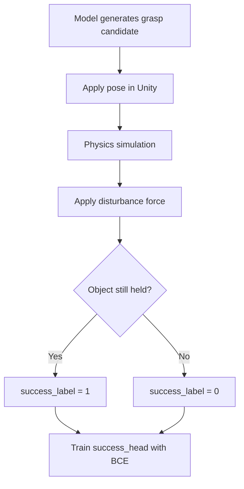

Phase 3'te:

- Backbone dondurulabilir.
- Unity success label gerekir.
- `success_head` BCE loss ile egitilir.

Henuz tamamlanmayan kisim:

```text
Unity physics label pipeline
```

Bu tamamlanmadan `success_prob` fiziksel basari olasiligi gibi yorumlanmamalidir.

---

## 17. Hocanin Sorabilecegi Sorular ve Kisa Cevaplar

## Soru 1: Neden OakInk ile basladin?

**Cevap:**

OakInk genis obje cesitliligi sagliyor. HOT3D temporal ama obje sayisi az. Bu yuzden once OakInk ile statik obje-grasp iliskisini ogrettim, sonra HOT3D ile temporal davranisa fine-tune ettim.

## Soru 2: Neden object-relative koordinat kullandin?

**Cevap:**

Modelin dunya koordinatini ezberlemesini istemiyorum. Elin objeye gore konumu onemli. Bu nedenle `T_wrist_in_object = inverse(T_object_in_world) @ T_wrist_in_world` kullandim.

## Soru 3: Neden PointNet?

**Cevap:**

Bounding box objenin ince geometrisini kaybeder. Point cloud ise kulp, ince sap, bosluk gibi geometrik farklari temsil eder. Mini PointNet de hafif ve yeterince pratik bir global geometry encoder saglar.

## Soru 4: Neden GRU?

**Cevap:**

Grasp dinamik bir surec. Tek frame modeli elin yaklasma yonunu, hizini ve kapanis surecini goremez. GRU son 16 frame'i ozetleyerek temporal baglam saglar.

## Soru 5: Neden self-attention?

**Cevap:**

Parmak eklemleri birbirinden bagimsiz degil. Self-attention, 15 eklem arasindaki koordinasyonu ogrenmek icin kullanildi.

## Soru 6: Neden CVAE?

**Cevap:**

Ayni obje icin birden fazla gecerli grasp olabilir. CVAE bu multi-modality'yi modellemek icin eklendi. Mevcut sonuclarda diversity dusuk, bu da sonraki iyilestirme konusu.

## Soru 7: Contact ratio neden dusuk?

**Cevap:**

Model pose reconstruction'i ogreniyor ama contact loss sinyali yeterince guclu degil. Ayrica mevcut penetration/contact hesaplari proxy tabanli. Gercek mesh SDF veya Unity PhysX tabanli feedback ile iyilestirme gerekiyor.

## Soru 8: Unity success_prob neden henuz kullanilamaz?

**Cevap:**

`success_prob` head mimaride var, ancak onu egitmek icin Unity physics success label gerekiyor. Bu label pipeline tamamlanmadan success_prob sadece kalibre edilmemis bir cikti olur.

---

## 18. Sunum Icin 5 Dakikalik Akis

Eger kisa anlatman gerekirse:

1. **Problem:** VR'da controller elini hareket ettiriyor ama parmak kavramasi objeye uygun degil.
2. **Fikir:** Kullanici bilegi kontrol etsin, AI objeye uygun parmak pozunu uretsin.
3. **Veri:** OakInk statik grasp ogretiyor, HOT3D temporal kapanis ogretiyor.
4. **Ortak format:** Her seyi `frame_feat(B,T,13)` object-relative temsile cevirdim.
5. **Model:** PointNet obje geometrisini, GRU temporal hareketi, self-attention parmak koordinasyonunu, CVAE coklu adaylari modelliyor.
6. **Phase 1:** OakInk ile statik grasp pre-training yapildi.
7. **Phase 2:** HOT3D ile temporal fine-tuning yapildi.
8. **Sonuc:** Pose reconstruction makul, temporal pipeline calisiyor.
9. **Sinir:** Contact, joint limits, CVAE diversity ve Unity success calibration gelistirilmeli.

---

## 19. Sunum Icin Tek Paragraflik Ozet

Bu tezde VR/XR ortaminda kullanicinin controller ile kontrol ettigi elin parmak kavramasini objeye uygun hale getiren bir yapay zeka modeli gelistirdim. Kullanici bilek hareketini kontrol etmeye devam ediyor; model sadece parmak eklem rotasyonlarini uretiyor. Bunun icin OakInk'ten genis statik grasp bilgisi, HOT3D'den temporal el-obje hareketi kullandim. Iki veri setini ortak `frame_feat(B,T,13)` object-relative formata cevirdim. Model objeyi 1024 noktalik point cloud ve Mini PointNet ile, elin son frame'lerdeki hareketini GRU ile, parmaklar arasi koordinasyonu self-attention ile, coklu grasp olasiliklarini CVAE ile modelliyor. Phase 1'de OakInk ile statik grasp pre-training tamamlandi. Phase 2'de HOT3D ile temporal fine-tuning yapildi. Mevcut sistem pose reconstruction ve temporal pipeline tarafinda calisiyor; ancak fiziksel temas kalitesi, joint limit ihlalleri, CVAE diversity ve Unity physics tabanli success calibration henuz gelistirilmesi gereken ana alanlar.

---

## 20. Sonraki Isler

| Oncelik | Is | Neden Onemli? |
|---|---|---|
| 1 | Contact loss redesign | Parmaklarin gercek yuzeye yaklasmasi icin |
| 2 | Joint limit regularization artisi | Anatomik olarak daha dogru el pozlari icin |
| 3 | Unity physics success label | Fiziksel basariyi dogrudan olcmek icin |
| 4 | Phase 3 success calibration | `success_prob` ciktisini anlamli hale getirmek icin |
| 5 | CVAE KL / diversity sweep | K aday uretiminin gercekten fayda saglamasi icin |
| 6 | Ablation experiments | Hangi mimari parcanin ne kadar katkisi oldugunu kanitlamak icin |
| 7 | Latency benchmark | XR runtime uygunlugunu gostermek icin |

